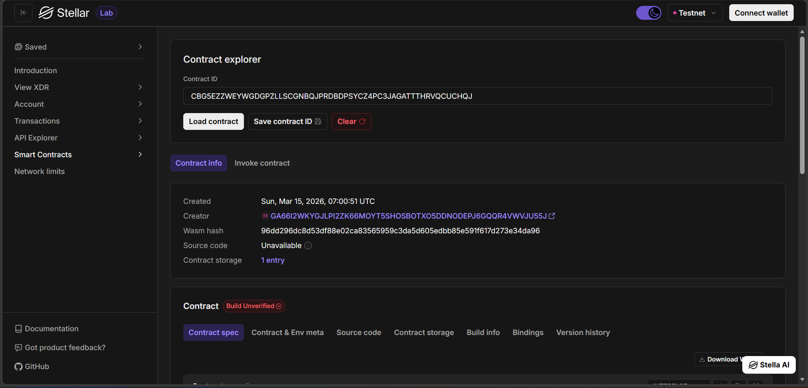

# Soroban Job Board DApp

A decentralized hiring app built with Soroban + React.

Employers can post jobs and manage applications. Applicants can browse jobs and apply using Freighter wallet authorization.

## Features Based On Your Code

- Wallet connect/reconnect/disconnect with Freighter
- Network mismatch check (wallet network vs app network)
- Job board with open jobs
- Create new jobs
- Apply to jobs
- My Applications view
- Employer Dashboard to:
  - view own jobs
  - open/close jobs
  - accept/reject applications
- Toast notifications for success/error/info

## Contract Methods Used In Frontend

The frontend contract layer in `frontend/src/contract.ts` calls these methods:

- `create_job`
- `get_job`
- `set_job_open_status`
- `apply_to_job`
- `get_application`
- `set_application_status`
- `list_job_application_ids`
- `list_applicant_application_ids`

## Current Repository Structure

```text
soroban-jobapplication/
|- README.md
|- package.json
|- frontend/
|  |- .env
|  |- .env.example
|  |- package.json
|  |- src/
|  |  |- App.tsx
|  |  |- contract.ts
|  |  |- components/
|- contracts/
|  |- project-files/
|  |  |- Cargo.toml
|  |  |- README.md
|  |  |- transaction.png
|- backend/
|- walate.png
|- prof.png
```

## How It Connects

1. UI components in `frontend/src/components/*` collect user inputs.
2. `frontend/src/contract.ts` builds Soroban contract calls.
3. Read calls are simulated through Soroban RPC.
4. Write calls are signed in Freighter and submitted to the network.
5. Returned values are normalized and shown in React UI.

Flow:

`React UI -> contract.ts -> Soroban RPC -> Smart Contract`

## Clone This Project

```bash
git clone <your-github-repo-url>
cd soroban-jobapplication
```

## Setup And Run

1. Install frontend dependencies

```bash
npm install --prefix frontend
```

2. Create/update env file (already present in this repo as `frontend/.env.example`)

Windows PowerShell:

```powershell
Copy-Item frontend/.env.example frontend/.env -Force
```

macOS/Linux:

```bash
cp frontend/.env.example frontend/.env
```

3. Set env values in `frontend/.env`

```env
VITE_CONTRACT_ID=CC5FRNAQXYIJ6QCGUK7TXHHOHVONRF3ARBG7EZM36PPSJL66ANCPBDYA
VITE_RPC_URL=https://soroban-testnet.stellar.org
VITE_NETWORK_PASSPHRASE=Test SDF Network ; September 2015
```

4. Run app from root

```bash
npm run dev
```

5. Open the Vite URL shown in terminal (example: `http://localhost:5173`)

6. Connect Freighter and switch to Testnet

## Build Commands

Frontend build:

```bash
npm run build
```

Frontend preview:

```bash
npm run preview
```

## Contract Workspace Note

This repo currently has contract workspace files in `contracts/project-files`.

If you want to build/deploy contract from this repo, make sure the actual contract source files are present (for example `src/lib.rs` under that workspace). Right now, frontend contract calls are ready and configured, but Rust source files are not visible in the current folder layout.

## Images Section

Current images in your repo:




Add more screenshots by creating files and adding links like:

```md


```

## Troubleshooting

- If wallet connection fails, ensure Freighter is installed and enabled.
- If transactions fail, ensure wallet network is Testnet.
- If data is empty, verify `VITE_CONTRACT_ID` is correct.
- If app does not open, check terminal for the current Vite port.

