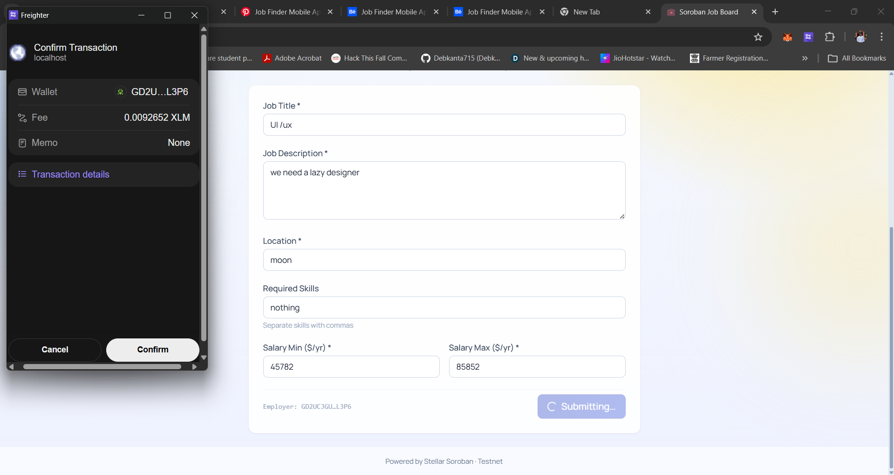
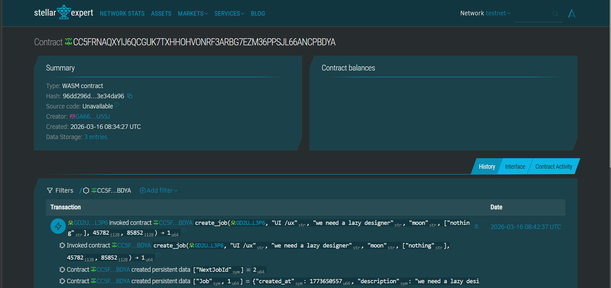

# Soroban Job Board DApp

A full-stack Stellar Soroban project for decentralized hiring.

Employers can post jobs and manage applicants on-chain. Applicants can browse jobs and apply using wallet authorization.

## What This Project Includes

- Soroban smart contract in Rust (`contracts/hello-world`)
- React + Vite frontend (`frontend`) with Freighter wallet integration
- Testnet deployment setup using Stellar CLI aliases

## Current Testnet Deployment

- Contract Alias: `hello_world`
- Contract ID: `CC5FRNAQXYIJ6QCGUK7TXHHOHVONRF3ARBG7EZM36PPSJL66ANCPBDYA`
- Explorer: https://stellar.expert/explorer/testnet/contract/CC5FRNAQXYIJ6QCGUK7TXHHOHVONRF3ARBG7EZM36PPSJL66ANCPBDYA

## Screenshots

### Wallet Connection



### Profile / UI View



### Contract Transaction Proof


## Smart Contract Features

- Create job postings
- Open and close jobs (owner only)
- Apply to open jobs
- Accept or reject applications (job owner only)
- List applications by job
- List applications by applicant
- Prevent duplicate applications from the same applicant for the same job

## Contract Methods

- `create_job(...) -> u64`
- `get_job(job_id: u64) -> Option<Job>`
- `set_job_open_status(employer, job_id, is_open)`
- `apply_to_job(...) -> u64`
- `get_application(application_id: u64) -> Option<Application>`
- `set_application_status(employer, application_id, status)`
- `list_job_application_ids(job_id) -> Vec<u64>`
- `list_applicant_application_ids(applicant) -> Vec<u64>`

## Validation Rules and Errors

Enforced rules:

- `salary_min >= 0`
- `salary_max >= salary_min`
- job must exist
- application must exist
- job must be open for new applications
- only job owner can update job/application status
- applicant cannot apply twice to the same job

Contract error codes:

- `InvalidSalaryRange = 1`
- `JobNotFound = 2`
- `ApplicationNotFound = 3`
- `JobClosed = 4`
- `NotJobOwner = 5`
- `AlreadyApplied = 6`

## Frontend Features

- Wallet connect, reconnect, and in-app disconnect (Freighter)
- Network safety checks (wallet network must match dapp network)
- Wrong-network warning UI
- Job board with apply modal
- Create job form
- Applicant dashboard (my applications)
- Employer dashboard (manage jobs and application statuses)
- Auto-dismissing toast notifications

## Tech Stack

- Rust 2021
- `soroban-sdk` v25
- Stellar CLI (`stellar`)
- React 18 + TypeScript + Vite
- `@stellar/stellar-sdk` v14
- `@stellar/freighter-api` v6
- Tailwind CSS

## Project Structure

```text
soroban-jobapplication/
├─ Cargo.toml
├─ package.json
├─ README.md
├─ contracts/
│  └─ hello-world/
│     ├─ Cargo.toml
│     ├─ Makefile
│     └─ src/
│        ├─ lib.rs
│        └─ test.rs
└─ frontend/
   ├─ package.json
   ├─ .env
   ├─ .env.example
   └─ src/
      ├─ contract.ts
      ├─ App.tsx
      └─ components/
```

## Prerequisites

- Rust toolchain
- Stellar CLI (`stellar`)
- Node.js 18+
- Freighter browser extension

## Run Contract Tests

From repository root:

```bash
cargo test -p hello-world
```

## Build Contract

From contract folder:

```bash
cd contracts/hello-world
stellar contract build
```

Output wasm:

```text
target/wasm32v1-none/release/hello_world.wasm
```

## Deploy Contract (Testnet)

Example command used in this project:

```bash
stellar contract deploy --package hello-world --source-account alice --network testnet --alias hello_world
```

Check alias:

```bash
stellar contract alias show hello_world
```

## Frontend Setup

From repository root:

```bash
npm install --prefix frontend
```

Create/update env file:

```bash
cp frontend/.env.example frontend/.env
```

Set these values in `frontend/.env`:

```env
VITE_CONTRACT_ID=CC5FRNAQXYIJ6QCGUK7TXHHOHVONRF3ARBG7EZM36PPSJL66ANCPBDYA
VITE_RPC_URL=https://soroban-testnet.stellar.org
VITE_NETWORK_PASSPHRASE=Test SDF Network ; September 2015
```

## Run Frontend

From repository root:

```bash
npm run dev
```

This root script proxies to `frontend` and starts Vite.

Build frontend:

```bash
npm run build
```

Preview production build:

```bash
npm run preview
```

## Example Contract Invocations

Create job:

```bash
stellar contract invoke \
	--id hello_world \
	--source-account alice \
	--network testnet \
	-- create_job \
	--employer GBXXXXXXXXXXXXXXXXXXXXXXXXXXXX \
	--title "Rust Smart Contract Engineer" \
	--description "Build secure Soroban applications" \
	--location "Remote" \
	--required_skills '["Rust","Soroban","Testing"]' \
	--salary_min 3000 \
	--salary_max 7000
```

Get job:

```bash
stellar contract invoke \
	--id hello_world \
	--network testnet \
	-- get_job \
	--job_id 1
```

Apply to job:

```bash
stellar contract invoke \
	--id hello_world \
	--source-account alice \
	--network testnet \
	-- apply_to_job \
	--applicant GBYYYYYYYYYYYYYYYYYYYYYYYY \
	--job_id 1 \
	--cover_letter "I have Rust and smart contract experience." \
	--resume_link "https://example.com/resume.pdf"
```

## Notes

- `npm run dev` must be run from repository root (or run `npm run dev` directly in `frontend`).
- If wallet transactions fail, confirm Freighter network matches `Testnet`.
- If UI appears blank, check the current Vite port in terminal output.

## Future Improvements

- Pagination for job and application lists
- Event indexing for faster frontend reads
- Employer/applicant profile metadata
- Better filtering/search for jobs

---

Built with Soroban, Stellar RPC, and Freighter wallet integration.

